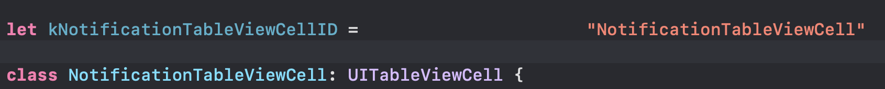
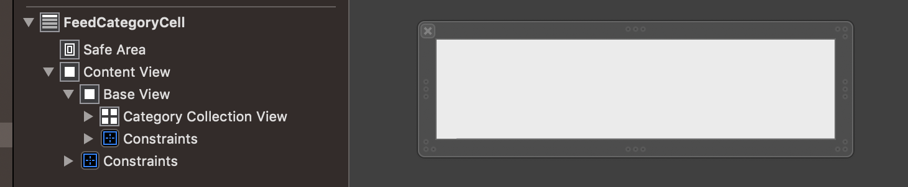
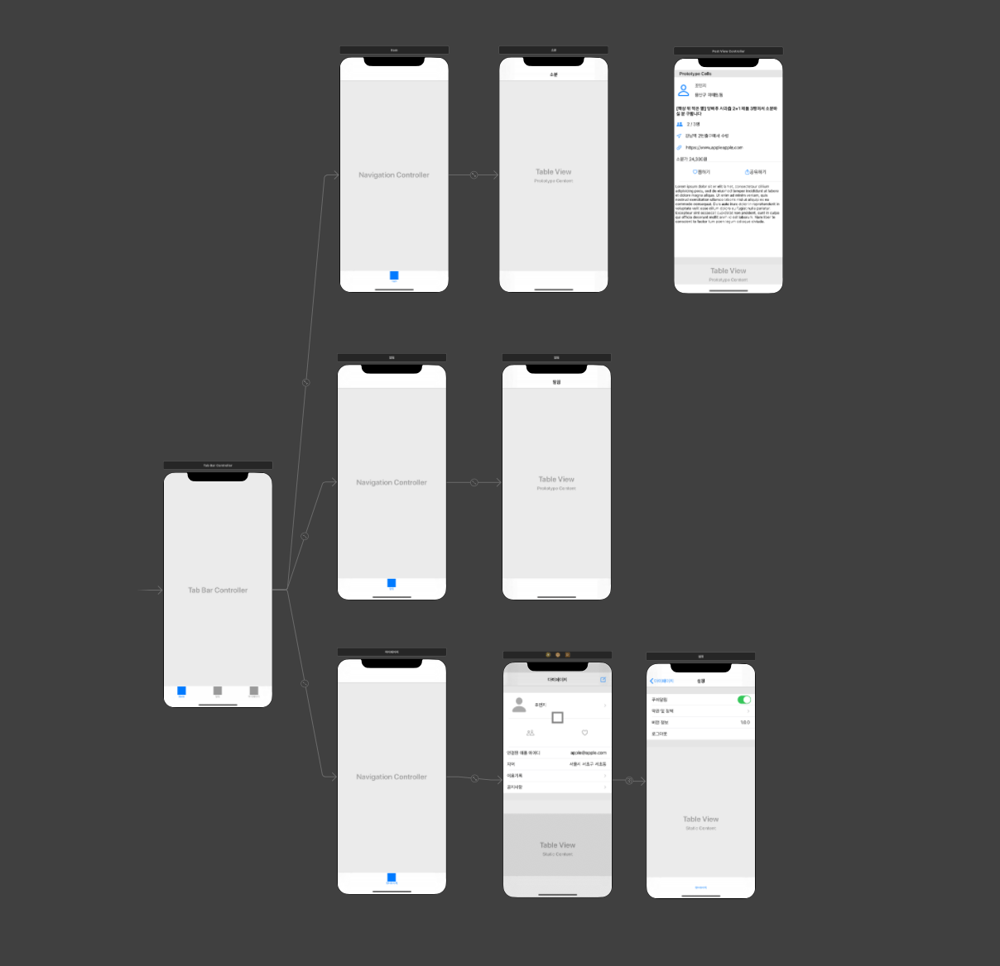
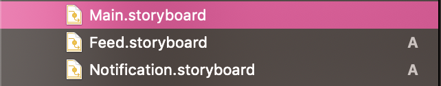

- cell reuse ID
  - 
  - cell reuse ID는 Cell 클래스 위에 상수로 ID를 선언해놓기
  - 변경 대비!!
- Base View
  - Base는 기본!!!
  - 해당 뷰를 언제 어디서 재사용할 수 있을지 모른다. Base View 를 만들어서 복붙 가능하게 만들자😍
  - 
  - Content View가 있어서 복사 붙여넣기가 될 줄 알았지만.. 복붙을 할 수 없다.
  - 뷰를 만들 때 항상 이 Base View를 만들면 편하게 개발 가능할 것 같다.
- Base ViewController
  - Base는 기본!!!
  - BaseViewController를 만들어서 뷰컨트롤러를 생성할 때 BaseViewController를 상속받게 만든다.
    - `class ViewController: BaseViewController { } `
  - BaseViewController를 상속받은 뷰컨트롤러들은 상속을 통해 속성, 기능을 한 번에 적용 가능하다.
    - 다크모드, 옵저버, navigationBarHidden... 등
  - 바꾸고 싶은 속성이 있다면 override로
  - 
- 스토리보드를 나누자
  - 
  - 여러명이서 협업할 경우 스토리보드 conflict가 나는 경우가 많다.
  - 기능 별로 스토리보드를 나누게 되면 conflict를 줄일 수 있다.
    - Feed, Notification..
    - 
  - 다른 사람이 프로젝트를 봤을 때 명확하게 어떤 기능인지를 알 수 있는 장점도 있다.
  - 한 스토리보드를 쓸 데 없이 자잘하게 나누면 기능 플로우를 못 보니까 좋지 않을 것 같다. → 기능별로 스토리보드를 나누면 좋을 듯!
- estimatedRowHeight
  - `tableView.estimatedRowHeight = 200.0`
  - 테이블 뷰에게 row의 높이가 대충 이 정도일 것이라는 것을 알려준다.
  - 이 값을 설정해주지 않으면 갑자기 훅 줄어드는(?) 현상이 보일 수도 있다.
  - 근사값으로 설정해주자
- UITableView.automaticDimension
  - `feedTableView.rowHeight = UITableView.automaticDimension`
  - 테이블 뷰의 row의 높이가 유동적이라는 것을 선언한다.
  - Cell의 BaseView의 heigth를 지정해주고 automaticDimension 설정해주기 

- 네이밍
  - `tableView` 보다는 `feedTableView` 처럼 디테일한 네이밍
  - 기본적인 이름과 겹침

----

- 애니메이션
- 커스텀 뷰 + 테이블 뷰 (셀 0: 컬렉션 뷰)

- 

- bottom 을 safe Area.bottom이 아니라 superView.bottom 으로 잡아준다
- 

-   **@IBOutlet** **weak** **var** dateBaseView: UIView!

    **@IBOutlet** **weak** **var** dateBaseViewHeightConstraint: NSLayoutConstraint!

  `dateBaseView.layer.cornerRadius = dateBaseViewHeightConstraint.constant / 2.0`

- 

- 벡터 이미지 색깔 바꾸기 

  - `iconImageView.image = UIImage(named: "icon_people")?.withRenderingMode(.alwaysTemplate)`
  - `iconImageView.tintColor = kGRAY_800`

-  flowLayout.headerReferenceSize = .zero

  ​    flowLayout.footerReferenceSize = .zero

  ??????

- header footer view xib 오류

  - 
  - background가 default여야한다.?
  - deprecated 됨

- tableView에 UINib register

  - `mainTableView.register(titleHeaderView, forCellReuseIdentifier: kFeedTitleHeaderViewID)`

  -    ` mainTableView.register(titleHeaderView, forHeaderFooterViewReuseIdentifier: kFeedTitleHeaderViewID)`

  - 2로 해야하는데... 1로 해놓고 왜 안될까 계속 고민함..ㅎㅎ...........등록한 nib도 다시 보자

    

    